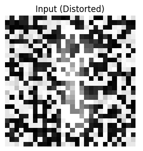
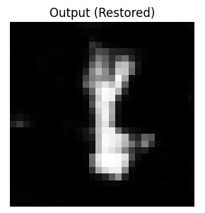
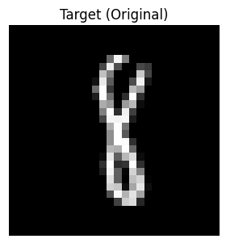
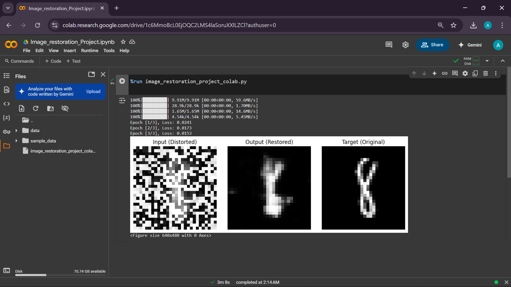

# 🧠 Image Restoration Attempt Through Scattering Media

This project is a minimal replication inspired by the research paper:

**"Resolution imaging through dynamic scattering media"**  
by *Dr. Sujit Kumar Sahoo et al.*, published in *Nature Communications*.

---

## 📌 Objective

To explore how neural networks can restore distorted images after passing through scattering media, using techniques from computational imaging and deep learning.

---

## 🔧 Method Overview

- Used MNIST digits distorted to simulate scattering effects  
- Trained a simple neural network using PyTorch  
- Learned a direct mapping from distorted inputs to clean targets  
- Visualized the restoration results using Google Colab

---

## 🖼️ Sample Output

| Distorted Input | Restored Output | Ground Truth |
|-----------------|------------------|---------------|
|  |  |  |

> _Note: Images are illustrative. Actual output can be found below from the notebook run._

---

## 📷 Screenshot from Colab Execution



---

## 🧪 Run the Code

### ▶️ Option 1: Google Colab  
[](https://colab.research.google.com/drive/1c6MMmoBcL0EjOQC2LMS4laSoruXXlZCl?usp=sharing)  
> Just run the single cell to reproduce the restoration result.

### 🖥️ Option 2: Run Locally (Optional)

```bash
git clone https://github.com/your-username/image-restoration-scattering-media.git
cd image-restoration-scattering-media
python image_restoration.py
```

---

## 🙋‍♂️ Author

**ADHIN C**  
Second Year B.Tech CSE  
Government Engineering College, Wayanad, Kerala  
📧 [adhin.csan@gmail.com]

---

## 💡 Inspiration

This mini-project is a tribute to the impactful work of **Dr. Sujit Kumar Sahoo**.  
It reflects my strong interest in **Artificial Intelligence**, **Computational Imaging**, and **Interdisciplinary Innovation**.


